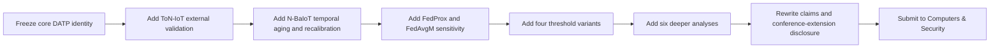

# Journal Extension Audit for DATP

## Executive summary

The current DATP paper already has a **real and defensible core contribution**: it isolates **threshold calibration scope** as the only manipulated variable in a federated IoT anomaly-detection pipeline, keeping the FedAvg autoencoder, training regime, seeds, and per-client score artifacts fixed while comparing shared, per-client, family-mean, and cluster-mean threshold policies. In that controlled setting, the manuscript reports a large reduction in cross-client false-positive disparity on N-BaIoT when moving from the shared threshold B1 to the per-client threshold B2, while showing no gain under the near-homogeneous CICIoT2023 pseudo-client partition. That claim is narrow, but it is scientifically cleaner than many surrounding FL-IoT IDS papers, which often vary model, aggregation, and partition regime simultaneously. fileciteturn5file2 fileciteturn5file8 fileciteturn5file10

The strongest journal path is **not** to turn DATP into a generic personalized FL paper. The strongest path is to keep the paper centered on **device-aware threshold personalization** and add a **strong but controlled extension package**: one genuinely new external validation dataset, one temporal threshold-aging and recalibration experiment family, a limited aggregation sensitivity layer, a small set of new threshold variants, and a deeper analysis suite that explains *when* DATP helps and *why*. That package directly answers the most dangerous reviewer attacks without changing the paper’s identity. fileciteturn5file7 fileciteturn5file11 fileciteturn5file12

The biggest risks are clear. First, a reviewer can say **“B2 equalizes FPR by construction, so where is the novelty?”** Second, the external evidence base is still thin because the primary confirmatory condition uses **nine N-BaIoT devices**, while the CICIoT2023 check relies on **file-level pseudo-clients** rather than physical device identities. Third, the manuscript explicitly leaves open **drift, recalibration, privacy leakage, adversarial robustness, hardware cost, and model-level personalization**, which are all legitimate targets in a journal review. Fourth, if the work remains too close to the conference version, the journal extension may look incremental rather than substantially new. fileciteturn5file2 fileciteturn5file6 fileciteturn5file13

My final recommendation is to pursue a **Strong** extension, not a Minimal one and not an Ambitious rewrite. The best lead target is **Computers & Security** because the topical fit is strongest for FL-based IDS/anomaly detection, recent closely related works appear there, and the journal has explicit evidence of publishing “considerably extended” versions of conference papers in special issues. The safest policy-oriented backup is **Computer Networks**, whose Guide for Authors explicitly states that enhanced, extended versions of quality conference/workshop papers can be submitted. In either case, the practical recommendation is to **wait until the conference outcome is settled** before submitting the overlapping journal extension, unless the conference version is withdrawn or the journal manuscript becomes substantially differentiated first. citeturn20view3turn28view3turn11search0turn13view2

## Reconstructing the current paper

The manuscript is titled **“Device-Aware Threshold Personalization: A Controlled Threshold-Calibration Study for Non-IID Federated IoT Anomaly Detection.”** Its abstract states that the paper isolates threshold calibration scope as the sole experimental variable, compares B1–B4 threshold policies under a fixed FedAvg autoencoder, and reports that on N-BaIoT, B2 reduces CV(FPR) from **1.017** to **0.299** with all five seed deltas positive, while B4 recovers about **52%** of the disparity reduction without a taxonomy. The same abstract also states the paper’s explicit limits: nine devices, E=1, five seeds, and a CICIoT2023 conclusion restricted to the tested randomized pseudo-client partition. fileciteturn5file2

The true scientific center of DATP is not “personalized FL” in the broad literature sense. It is a much narrower question: **how much of cross-client alarm unfairness is caused by threshold scope alone after model training is frozen?** The manuscript is unusually explicit about this boundary. It positions itself against model-level personalization methods such as Per-FedAvg and FedPer, and against aggregation-level methods such as FedMSE, by arguing that those methods modify different layers of the pipeline, whereas DATP fixes the shared model and changes only the **post-training alarm boundary**. That narrowness is both the paper’s greatest strength and its most obvious reviewer target. fileciteturn5file8 fileciteturn5file10

The current paper can be reconstructed as follows.

| Element | Current paper status | Reviewer interpretation |
|---|---|---|
| Core contribution | Threshold-only controlled comparison under a fixed federated AE | Clean experimental isolation; stronger internal validity than typical FL-IDS papers |
| Main manipulated variable | Threshold scope: B1 shared, B2 per-client, B3 family mean, B4 cluster mean | Narrow but precise |
| Main confirmatory regime | N-BaIoT, K=9 physical devices, five seeds | Strongest part of the paper |
| Supportive regime | CICIoT2023 file-level pseudo-clients | Useful boundary condition, but weaker realism |
| Exploratory components | B3/B4 grouping and Dirichlet heterogeneity sweep | Valuable, but secondary |
| Primary metric | CV(FPR) across eligible clients | Good alignment with the fairness/false-alarm burden story |
| Other metrics | TPR, balanced accuracy, Macro-F1, IQR(FPR), worst-client balanced accuracy, P10 Macro-F1, coverage ratio | Enough for conference level; analyzable further for journal level |
| Statistical method | Five seeds, per-seed deltas, descriptive seed summaries, bootstrap CI with 10,000 resamples | Reasonable but still light for journal scrutiny |
| Current limits | 9 devices, E=1, pseudo-clients, no privacy/adversarial/hardware analysis | Main attack surface for reviewers |

This reconstruction is grounded in the attached DATP paper. fileciteturn5file2 fileciteturn5file9 fileciteturn5file10

What should **not** be disturbed in the journal version is equally important. The strongest supported claims are: the threshold-scope-only experimental design; the existence of substantial cross-client FPR dispersion under a shared threshold on heterogeneous physical devices; the magnitude and consistency of B1→B2 dispersion reduction on N-BaIoT; the absence of improvement under the tested near-homogeneous CICIoT2023 pseudo-client regime; and the practical interpretation of B4 as a partial, taxonomy-free compromise. Those are the parts already anchored by the current artifact and should remain the center of the journal argument. fileciteturn5file2 fileciteturn5file6

## What the state of the art and fresh literature imply

Your attached state-of-the-art document is analytically strong and, importantly, already frames the literature in the right way: by **evidence cluster**, not just by paper count. It identifies direct FL-IoT malware/IDS work, adjacent security-traffic work, transferable FL methods, dataset concentration, heterogeneity stressors, privacy gaps, and deployment realism gaps. It also reaches a particularly important conclusion: heterogeneity is the central empirical stressor in FL-IoT IDS, but current remedies are **fragmented** across different assumptions, datasets, and layers of intervention. fileciteturn5file0 fileciteturn5file3 fileciteturn5file5

Fresh literature broadly supports that framing. Rey et al. in *Computer Networks* showed federated malware detection on N-BaIoT using supervised and unsupervised models and including seen/unseen device conditions, which makes it one of the closest direct precursors to DATP at the **shared-model anomaly-detection** layer. Olanrewaju-George and Pranggono later compared unsupervised and supervised FL-trained deep models on N-BaIoT and reported the AE as the strongest overall model in their tested setting. Nguyen and Beuran’s **FedMSE** pushed the literature toward semi-supervised anomaly detection plus heterogeneity-aware aggregation on N-BaIoT, while Sáez-de-Cámara et al. proposed a **clustered federated learning architecture** for anomaly detection in large heterogeneous IoT/IIoT deployments using a large emulated testbed and real attacks. These papers all strengthen the surrounding literature—but none of them reframes the problem as a **threshold-scope isolation study**. citeturn20view4turn20view2turn20view3turn28view3

That means DATP’s novelty is still real, but it is **conditional novelty**, not broad novelty. The paper is novel **if it claims to isolate threshold scope under a frozen federated encoder and measure per-client alarm-rate dispersion**. It is not novel if it tries to claim that it solves non-IID FL generally, or that threshold personalization dominates aggregation personalization or model personalization everywhere. Your current manuscript mostly respects that distinction; the journal version must keep respecting it. fileciteturn5file8 fileciteturn5file10

The strongest *threats* to DATP’s journal novelty are not direct duplicates, but **adjacent capability papers** that make DATP look too narrow if it is not extended. FedMADE is particularly important because it directly targets heterogeneous IoT intrusion detection under class imbalance and poisoning, using dynamic aggregation around class-wise contributions, and reports large minority-class benefits with modest overhead. FedP3E is also important because it treats non-IID IoT malware detection through prototype exchange rather than thresholding, which means it attacks the same **heterogeneity pain point** from another layer of the system. Meanwhile, newer FL IDS papers are increasingly comparing aggregation strategies under heterogeneous conditions, including FedAvg, FedAvgM, FedProx, and robust averaging variants, with the rankings turning out to be **dataset-dependent** rather than universal. That makes it harder for DATP to avoid at least a limited aggregation-sensitivity section in the journal version. fileciteturn5file3 citeturn24search1turn25search1turn28view2

The freshest literature also increases pressure on the **temporal** dimension. Drift-aware anomaly detection and concept-drift adaptation are now well-established concerns in anomaly detection generally, and there is now direct IoT-oriented work explicitly addressing concept drift in IoT anomaly detection. Conformal anomaly detection papers have also sharpened the field’s focus on **controlling false positive rates** rather than merely reporting raw anomaly scores. DATP’s story about false-alarm burden therefore becomes more compelling, not less—but only if the journal version starts discussing **threshold aging, recalibration frequency, and stability under time shift**. Otherwise, a reviewer can argue that the paper solves an initial calibration problem but says too little about sustained operation. citeturn26search0turn26search9turn27search26turn27search13

One important area remains under-evidenced. **Direct empirical studies of privacy leakage from transmitted thresholds, percentiles, or compact benign-distribution fingerprints in FL-IoT IDS were not found in available sources.** What *is* established is that FL broadly remains vulnerable to membership and property inference attacks, and that privacy-preserving methods such as secure aggregation, DP, and SMPC remain active concerns in the field. For DATP, that means threshold-summary leakage should be framed as a **plausible, unquantified risk**, not as a formally demonstrated attack in this exact setting. That distinction matters for reviewer trust. citeturn4search1turn4search20turn4search22 fileciteturn5file6

The literature therefore points to a clear strategic conclusion: DATP is **aligned** with the current state of the art, but it **underuses** it. It underuses the modern heterogeneity literature, the aggregation-comparison literature, the deployment/drift literature, and the “what exactly is being personalized?” distinction that could make its contribution look sharper rather than smaller. fileciteturn5file0 fileciteturn5file3

## Reviewer-2 red-team audit

The most damaging reviewer attacks are the ones that can undermine either novelty, external validity, or extension originality in a few sentences. The table below prioritizes the issues that matter most for a journal version.

| ID | Weakness | Severity | Why it matters | Fix type | New experiments |
|---|---|---:|---|---|---|
| W01 | **“B2 equalizes FPR by construction.”** | Critical | If unanswered, the paper can look tautological rather than scientific | Mandatory | Yes |
| W02 | **Only nine physical devices in the primary regime.** | Critical | Limits external validity of the main confirmatory result | Mandatory | Yes |
| W03 | **CICIoT2023 uses pseudo-clients, not physical devices.** | Major | Weakens the generalization boundary and may be dismissed as an artifact | Mandatory | Yes |
| W04 | **No temporal threshold-aging or recalibration study.** | Critical | Journal reviewers increasingly expect sustained-operational reasoning, not only one-shot calibration | Mandatory | Yes |
| W05 | **No aggregation sensitivity beyond fixed FedAvg.** | Major | Literature now shows aggregation rankings can flip by dataset and heterogeneity structure | Mandatory | Yes |
| W06 | **No model-personalization reference point.** | Major | Reviewers may ask whether threshold-only personalization is simply a weaker form of personalization | Recommended | Possibly |
| W07 | **No explicit privacy-leakage quantification for shared summaries/fingerprints.** | Moderate | The paper already acknowledges metadata leakage risk; journals will expect that sentence to be strengthened | Recommended | No, if framed carefully |
| W08 | **Five seeds and light inferential statistics.** | Moderate | Journal review will ask about power, stability, and effect size | Recommended | Mostly no |
| W09 | **Operational/fairness interpretation is present but could be made stronger.** | Moderate | Reviewers will care about false-alarm burden, worst-client behavior, and coverage | Recommended | No / recomputation |
| W10 | **Risk of insufficient conference-to-journal expansion.** | Critical | Even good experiments can fail if the extension looks too close to the conference paper | Mandatory | No, but large new material is needed |

The “B2 by construction” issue must be answered directly, not defensively. The correct response is that **equalization is expected mathematically only under stable calibration/test behavior**, but the journal contribution is the *held-out magnitude*, *seed stability*, *trade-off against TPR/Macro-F1*, *coverage behavior*, and *how much of the benefit can be recovered by deployable compromises such as B4 or shrinkage*. In other words, the paper is not proving that local percentiles equalize FPR in theory; it is quantifying the magnitude, robustness, and cost of that effect in federated IoT anomaly detection under real heterogeneity. That answer is already latent in the current manuscript, but the journal version must make it explicit much earlier and much more forcefully. fileciteturn5file2 fileciteturn5file6

The dataset criticisms are also unavoidable. N-BaIoT is still useful because it offers **real physical devices** and a natural device partition, but the attached state-of-the-art correctly notes its limitations: 2018 traffic, only two malware families, strong imbalance, and only nine devices. CICIoT2023 is far larger and newer, but in your current pipeline it becomes a file-level boundary condition rather than a physical-device study. A reviewer may therefore accept the *internal validity* of DATP while still rejecting the *external reach*. That is why at least one carefully chosen new dataset is mandatory. fileciteturn5file1 fileciteturn5file2

The journal-extension originality risk is not cosmetic. Elsevier journal guides generally require that submitted work not have been published previously except in limited forms such as preprints, abstracts, lectures, theses, or registered reports, and several Elsevier guides repeat that originality language. For **Computer Networks**, however, the Guide for Authors goes further and explicitly states that enhanced, extended versions of quality conference/workshop papers can be submitted. For **Computers & Security**, I did not find a regular-guide sentence with equally explicit regular-paper wording, but the journal does host special issues for “considerably extended” conference papers, which shows that such practice is accepted at least in some editorial channels. The safe conclusion is that conference extension is feasible, but only with a clearly substantial extension and explicit disclosure. citeturn13view2turn14view0turn14view2turn11search0

## Strongest realistic extension package

The correct package is a **Strong** extension with strict scope control. It should add enough to make the paper feel journal-grade, but not so much that the threshold-only identity disappears.

### The recommended package

| Component | Recommendation | Why it is in the package |
|---|---|---|
| New dataset | **ToN-IoT** | Best external stress-test for harsher non-IID partitioning and strongest bridge to prior FL-IDS heterogeneity work |
| Optional second dataset | **BoT-IoT** | Good botnet-oriented external validation if compute and preprocessing permit |
| New FL baseline families | **FedProx** and **FedAvgM** | Lowest-risk way to test whether DATP benefits survive different aggregation dynamics |
| Model-personalization comparator | **One only, supplementary**: Ditto or Per-FedAvg | Useful for rebutting “just do model personalization” but high scope-drift risk |
| New threshold variants | **q-sensitivity**, **robust cluster median**, **local-global shrinkage**, **calibration-size-aware fallback** | These deepen DATP without changing its identity |
| Temporal family | **Threshold aging + recalibration on chronological N-BaIoT** | Most journal-relevant missing dimension |
| Deeper analyses | **Six analyses**, mostly from existing artifacts | Highest reviewer value per unit effort |

The package above is the smallest set that closes the major holes created by the fresh literature. ToN-IoT is the best first new dataset because it is an official UNSW IoT/IIoT cybersecurity benchmark family, and prior FL IDS work already used it to show that realistic IP-based partitioning can severely penalize FL under strong heterogeneity. Bot-IoT is the best second option if you want another public benchmark with realistic botnet traffic and multiple data formats, but it is less directly aligned with DATP’s physical-device threshold story than N-BaIoT. IoT-23 is valuable as malware traffic, but it has too few benign device scenarios to be a strong mainline DATP calibration benchmark. Edge-IIoTset is modern and was explicitly proposed as usable in centralized and federated modes, but for DATP it is less attractive than ToN-IoT because the natural client and benign-calibration story is less clean. citeturn17search1turn21search0turn17search0turn17search3turn16search2turn18search11

The two most important new baseline families are **FedProx** and **FedAvgM**. FedProx is directly motivated by the heterogeneous-FL literature and has convergence/stability relevance under statistical heterogeneity. FedAvgM is motivated by newer FL IDS work showing that momentum-based federated averaging can materially outperform vanilla averaging on some security datasets, while underperforming on others. That dataset dependence is exactly why DATP needs a limited aggregation-sensitivity section: not to become an aggregation paper, but to show whether the threshold-level result is robust to reasonable changes in the training backbone. FedBN is a weaker choice here because the current AE has **no batch normalization**, so using FedBN would force a model redesign. Ditto or Per-FedAvg can be added only as a **single supplementary comparator**, otherwise the paper risks mutating into a broad personalized-FL study. citeturn1search2turn2search2turn28view2turn1search1turn2search0turn1search4 fileciteturn5file10

The best new threshold variants are the ones that remain obviously “DATP-like.” A **quantile sweep** at \(q \in \{0.90, 0.95, 0.975, 0.99\}\) is mandatory, because it tests whether the threshold-personalization benefit is specific to one operating point or stable across alarm conservativeness. A **robust cluster median** should replace or supplement B4’s cluster mean to reduce sensitivity to one unstable client in a cluster. A **local-global shrinkage threshold** should interpolate between B1 and B2 so that clients with little calibration data are partially pooled instead of fully individualized. A **calibration-size-aware fallback** should replace the current all-or-nothing fallback logic with a principled transition between personalized and shared thresholds as calibration counts increase. Those four additions all deepen the threshold contribution without breaking scope. By contrast, full conformal thresholding is scientifically interesting but likely too broad and too implementation-heavy for the main package; it belongs in optional future work or at most supplementary discussion. fileciteturn5file11 fileciteturn5file12 citeturn27search26turn27search13

The six deeper analyses that deliver the highest reviewer value are these:

| Analysis | Purpose | Likely effort | Priority |
|---|---|---:|---:|
| Benign reconstruction-error distributions per client | Show where shared-threshold misalignment comes from | Low | Must-do |
| Attack–benign separability per client | Explain why one client loses Macro-F1 under B2 | Low | Must-do |
| Divergence-versus-benefit correlation | Show whether DATP gain predicts from inter-client heterogeneity | Medium | Must-do |
| Threshold shift versus FPR/TPR response | Quantify the trade-off surface directly | Low | Must-do |
| Calibration-size sensitivity and coverage | Turn fallback eligibility into a real operational result | Low | Must-do |
| Operational burden reduction | Translate CV(FPR) into alert burden and worst-client relief | Low | Must-do |

All six analyses are directly supported by your own planning brief and are also the natural next step for a journal version because they convert the paper from “controlled result reporting” into “controlled empirical understanding.” fileciteturn5file12

## Dataset and venue strategy

The dataset strategy should be strict, not popularity-driven.

| Dataset | Recommendation | DATP fit | Main reason |
|---|---|---|---|
| **N-BaIoT** | Keep | Excellent | Still the best physical-device natural split for DATP’s core claim |
| **CICIoT2023** | Keep, but demote to boundary evidence unless repartitioned better | Moderate | Valuable scale and modernity, but current pseudo-client protocol is weak for mainline claims |
| **ToN-IoT** | **Add** | Strong | Best external non-IID stress-test and strongest bridge to prior FL heterogeneity work |
| **BoT-IoT** | **Maybe add** | Moderate to strong | Good botnet-oriented benchmark, but weaker natural threshold-personalization story |
| **Edge-IIoTset** | Maybe add | Moderate | Modern and FL-aware, but higher preprocessing and weaker client/calibration clarity |
| **IoT-23** | Reject for main experiments | Weak | Too few benign device scenarios for a strong DATP calibration narrative |
| **UNSW-NB15** | Reject as main evidence | Weak | Useful adjacent benchmark, but not central to the IoT threshold-personalization story |

This recommendation follows from the official or primary dataset descriptions and from the dataset concentration analysis already in your state-of-the-art file. N-BaIoT remains central because DATP is fundamentally about **device-conditioned benign error distributions**. ToN-IoT should be the first expansion because it offers a well-known external IoT/IIoT security benchmark family and ties directly into existing FL IDS heterogeneity evidence. BoT-IoT is a reasonable second dataset only if you can define a defensible client partition and retain enough benign data for calibration. IoT-23 is highly valuable as malware traffic, but it is not a strong mainline DATP dataset because its benign device coverage is too thin for a threshold-personalization study across many clients. fileciteturn5file1 citeturn17search1turn17search0turn16search2turn18search11

The venue strategy is similarly clear.

| Journal | Fit to DATP | Official policy evidence | Practical verdict |
|---|---|---|---|
| **Computers & Security** | Excellent topical fit | Generic originality language in guide; official special issue evidence of “considerably extended” conference papers | **Best target** if extension is strong |
| **Computer Networks** | Very strong fit | Guide explicitly allows enhanced, extended versions of quality conference/workshop papers | Best policy-safe backup |
| **Journal of Information Security and Applications** | Good fit | Generic originality language; no explicit conference-extension wording found in available official sources | Good fallback, but less sharp than top two |
| **Internet of Things** | Good IoT fit, weaker security specialization | Generic originality language; no explicit conference-extension wording found in available official sources | Possible, but not my first choice |

This table is grounded in official journal scope pages and guides. *Computers & Security* emphasizes IT security research and practice and is a natural home for IDS/anomaly detection work; it also has recent nearby FL IDS papers such as **FedMSE** and the clustered FL anomaly-detection architecture. *Computer Networks* is also highly defensible because its scope explicitly includes network security, intrusion detection, and malicious code, and its guide explicitly allows enhanced conference extensions. *JISA* and *Internet of Things* are plausible but less optimal either in specialization or in available policy clarity. citeturn6search0turn15search12turn20view3turn28view3turn13view2turn15search2turn15search4turn13view4

A crucial caveat belongs here. For **JNCA** and **Internet of Things**, I did **not** find an explicit official regular-paper statement in the available sources saying that expanded conference papers are accepted as such; what I found was the generic Elsevier originality declaration. For **Computers & Security**, I found evidence of the practice through a special issue for “considerably extended” conference papers, but not a blanket regular-guide sentence equivalent to *Computer Networks*. That means the venue choice is not only about scientific fit; it is also about how comfortable you are with policy explicitness. citeturn14view0turn14view2turn11search0turn13view2

## Final decision gate

My final decision is:

**Best target journal:** **Computers & Security**.  
**Best expansion level:** **Strong**.  
**Safest backup journal:** **Computer Networks**.  
**Should the journal extension wait until conference acceptance?** **Yes, in practice.** If the conference paper is still under review, the safest course is to avoid overlapping submission risk until that process is settled, unless you withdraw the conference version or create a much more differentiated manuscript first. citeturn20view3turn28view3turn13view2turn14view0turn14view2

The exact **must-do list before submission** is short and disciplined:

1. Add **ToN-IoT** as the mandatory new external dataset.  
2. Add a **temporal threshold-aging and recalibration** experiment on chronological N-BaIoT.  
3. Add **FedProx** and **FedAvgM** as limited aggregation-sensitivity baselines.  
4. Add four threshold-focused extensions: **q-sensitivity**, **robust cluster median**, **local-global shrinkage**, and **calibration-size-aware fallback**.  
5. Add the six deeper analyses listed above, especially the client-level separability and divergence-versus-benefit analyses.  
6. Rewrite the framing so the paper explicitly claims **threshold-scope isolation**, not broad personalized-FL superiority.  
7. In the journal manuscript and cover letter, explicitly disclose the conference ancestor and specify exactly what is new. fileciteturn5file11 fileciteturn5file12 fileciteturn5file13

The exact **do-not-do list** is just as important:

- Do **not** add three or more new datasets.  
- Do **not** pivot the paper into a generic model-personalization benchmark across FedBN, Ditto, APFL, and Per-FedAvg in the main paper.  
- Do **not** add a full adversarial-robustness branch, a full secure-aggregation branch, and a full hardware-deployment branch simultaneously.  
- Do **not** claim formal privacy protection unless you actually implement and evaluate it.  
- Do **not** overclaim that DATP “solves heterogeneity” rather than quantifying one specific and important calibration consequence of heterogeneity. fileciteturn5file6 fileciteturn5file13

A realistic roadmap looks like this:

The honest extension claim should read, in substance, like this: **the conference version established a controlled threshold-scope effect under a fixed federated autoencoder; the journal version substantially extends that result through external validation on an additional IoT benchmark, temporal threshold-aging and recalibration analysis, aggregation-sensitivity tests, new threshold variants, and deeper client-level analyses that explain when and why threshold personalization helps.** That is large enough to look like a real journal paper, but still coherent enough to remain DATP. fileciteturn5file2 fileciteturn5file10

## Open questions and explicit limits

A few issues remain genuinely open. First, direct empirical evidence on **privacy leakage from shared thresholds or compact calibration fingerprints** was **not found in available sources**; the strongest support in the literature is still at the broader FL privacy-attack level, not at the exact summary-statistic level used by DATP. Second, the regular-paper conference-extension policy is **explicitly verified** for *Computer Networks*, but only **indirectly evidenced** for *Computers & Security* through special-issue practice in the sources I found. Third, I did not find evidence strong enough to recommend a large-scale conformal-thresholding branch as part of the main extension package; it remains promising, but optional. citeturn4search1turn4search20turn4search22turn13view2turn11search0

Within those limits, the conclusion is firm: **DATP is journal-expandable, but only if the extension stays threshold-centered and becomes materially broader along external validation, temporal recalibration, aggregation sensitivity, and explanatory analysis.** If you execute that package cleanly, the paper can move from a good conference contribution to a credible journal article without losing its scientific identity. fileciteturn5file2 fileciteturn5file6